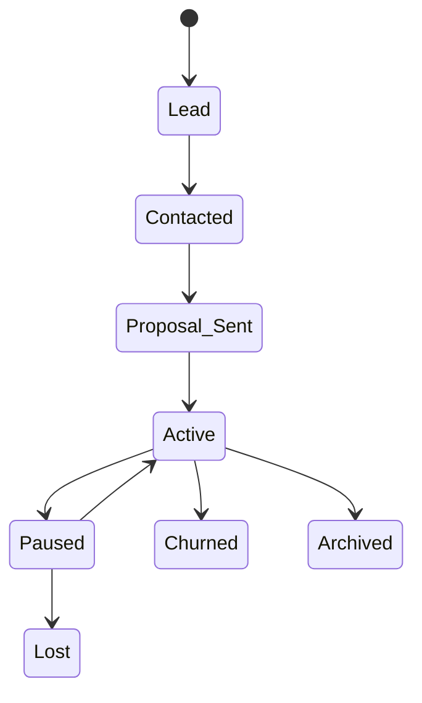

The Clients section is your built-in CRM for managing client organizations, contacts, and relationships. Track the full client lifecycle from lead to active account.

---

## Adding a Client

Navigate to **Clients** in the sidebar and click **"New Client"**.

### Client Details

| Field | Description |
|-------|-------------|
| **Company Name** | The client's business name |
| **Status** | Pipeline stage (see below) |
| **Industry** | Business industry |
| **Website** | Client's website URL |
| **Country / Timezone** | Location and time zone |
| **Tags** | Custom tags for organizing clients |
| **Account Manager** | Assign an agency team member to manage this account |
| **Notes** | Internal notes about the client |

### Financial Profile

| Field | Description |
|-------|-------------|
| **Billing Email** | Email address for invoices and billing communications |
| **Tax ID** | Client's tax identification number |
| **Default Payment Terms** | Net-X days applied to new invoices for this client |
| **Default Tax Rate** | Tax rate automatically applied to new invoices |
| **Payment Reliability** | Tracked payment behavior score |
| **Currency** | Client's preferred currency |

### Client Status Pipeline

Clients move through a lifecycle pipeline:

When a client purchases a service through the catalog, their status is automatically upgraded to **Active** if they were previously a Lead, Contacted, or Proposal Sent.

---

## Contacts

Each client organization can have multiple **contacts** — the people you work with at the client company.

### Contact Details

| Field | Description |
|-------|-------------|
| **Name & Email** | Contact identity (one contact per email per client) |
| **Phone** | Phone number |
| **Title** | Business title |
| **Role Type** | Decision Maker, Finance, Technical, Ops, or Other |
| **Preferred Channel** | Email, Phone, Slack, WhatsApp, or Other |
| **Stakeholder Flags** | Primary contact, billing contact, or approver |

### Portal Access

Contacts can be granted **portal access** to your agency's platform, allowing them to view their projects, tasks, invoices, and services.

Two ways to grant access:

<Tabs>
<Tab title="During contact creation" icon="user-plus">
Set a password when adding the contact. They can log in immediately.
</Tab>
<Tab title="Send an invite" icon="mail">
Click the **"Send Invite"** button on any contact without an account. They'll receive a branded invitation email and can set their own password via the "Forgot Password" flow.
</Tab>
</Tabs>

Portal users are assigned one of two roles:

| Role | Capabilities |
|------|-------------|
| **Organization Owner** | View projects, tasks, invoices, services. Can comment, create tasks, and update task statuses. Can view reports |
| **Organization Member** | Same views. Can create, edit, and assign tasks. Can add comments. Cannot view reports |

> **See also:** [Client Portal](./client-portal) for a detailed guide on what clients see and can do

---

## Client Detail Page

Each client's detail page is organized into tabs:

| Tab | What It Contains |
|-----|-----------------|
| **Overview** | Company details, financial profile, health score, lead pipeline, contract tracking |
| **Contacts** | Contact list, portal access management, send invite |
| **Projects** | Projects assigned to this client |
| **Invoices** | Invoices billed to this client |
| **Notes** | Internal team notes (General, Call, Meeting, Warning, Opportunity) |
| **Communications** | Interaction logs (calls, meetings, emails, decisions, issues, change requests) |
| **Documents** | Uploaded files (contracts, NDAs, SOWs, proposals, brand assets) |
| **Activity** | Full activity timeline for all client-related events |
| **Settings** | Client-specific settings (follow-ups, tags, account management) |

---

## Client List Page

The Clients list page at `/organizations` gives you an overview of all clients:

| Column | What It Shows |
|--------|--------------|
| **Company Name** | Client name |
| **Status** | Pipeline status badge |
| **Revenue** | Total revenue from invoices |
| **Unpaid** | Outstanding invoice amount |
| **Health** | Health indicator (green/yellow/red) |
| **Last Activity** | How recently you've interacted |

Sort by name, status, revenue, unpaid amount, health, last activity, creation date, or project count. Filter by name search, status, or health state.

---

## Notifications

| Event | Who Gets Notified |
|-------|------------------|
| New client organization created | Agency owners |
| Follow-up due today | Follow-up owner |
| Follow-up overdue | Follow-up owner |
| Contract expiring within 30 days | Agency owners |
| Client health state changed | Agency owners |

> **See also:** [Settings](./settings) for notification preferences
