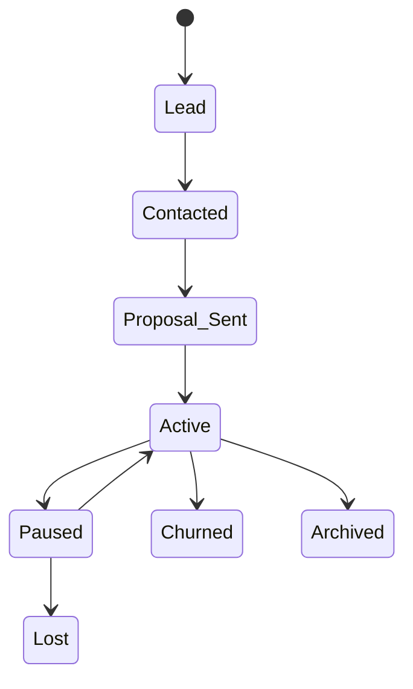

The Clients section is your built-in CRM for managing client organizations, contacts, and relationships. Track the full client lifecycle from lead to active account.

---

## Client List Page

The client list page at `/organizations` gives you an overview of all clients with three different view modes.

### View Modes

Switch between views using the toggle buttons or keyboard shortcuts:

| View | Description | Shortcut |
|------|-------------|:--------:|
| **Table** | Sortable table with columns, status badges, and selection checkboxes | `1` |
| **Pipeline** | Drag-and-drop Kanban board organized by status. Cards show logo, contact, deal value, and health | `2` |
| **Card Grid** | Responsive card layout showing logo, health, contact, tags, financial summary, and last activity | `3` |

Your preferred view is saved automatically and persists across sessions.

### Stats Bar

The top of the page displays key metrics — click any stat to pre-filter the list to that subset:

| Stat | What It Shows |
|------|--------------|
| **Total** | Total client count |
| **Active** | Clients with Active status |
| **Leads** | Clients in Lead stage |
| **At-Risk** | Clients with At Risk or Churn Risk health |
| **Pipeline Value** | Weighted deal value (expected value × probability) |
| **Conversion Rate** | Percentage of leads converted to active clients |

### Table Columns

| Column | What It Shows |
|--------|--------------| 
| **Company Name** | Client name (clickable → detail page) |
| **Status** | Pipeline status badge |
| **Health** | Health indicator (green/yellow/red) |
| **Revenue** | Total revenue from invoices |
| **Unpaid** | Outstanding invoice amount |
| **Last Activity** | How recently you've interacted |
| **Stale Indicator** | Amber pulse at 14 days, red pulse at 30 days of inactivity |
| **Pin** | ☆ toggle to favorite this client |

Sort by name, status, revenue, unpaid amount, health, last activity, creation date, deal value, or close date.

### Filters

| Filter | Type |
|--------|------|
| **Search** | Text search across name and contact name (press `/` to focus) |
| **Status** | Filter by pipeline status |
| **Health** | Filter by health state |
| **Industry** | Multi-select (advanced filters) |
| **Country** | Multi-select (advanced filters) |
| **Account Manager** | Multi-select (advanced filters) |
| **Tags** | Multi-select (advanced filters) |

Advanced filters are in an expandable panel with an active filter count badge.

### Saved Views

Save your current filter and sort combination as a **named view**:

- Click **"💾 Save View"** when filters are active
- Saved views appear as clickable pills above the content area
- Choose between **shared** (visible to all team members) or **personal** views
- Click any saved view to instantly apply its filters and sort

### Bulk Actions

Select multiple clients via checkboxes to perform bulk operations:

| Action | What It Does |
|--------|-------------|
| **Change Status** | Update the pipeline status for all selected clients |
| **Assign Manager** | Assign an account manager to all selected |
| **Add Tag** | Apply a tag to all selected clients |
| **Delete** | Delete selected clients (with confirmation) |

Press `Escape` to clear your selection.

### CSV Import & Export

- **Export** — Download your filtered client list as a CSV file
- **Import** — Upload a CSV file to bulk-create clients with a 4-step wizard: upload → auto-mapping → preview → create. Supports automatic duplicate detection (skip or overwrite)

### Duplicate Detection

When creating a new client, the system automatically checks for similar company names and shows a **"Possible duplicates"** warning with a similarity percentage. You can merge duplicate organizations using a side-by-side field comparison tool.

### Tag Management

Click the **"🏷 Tags"** button to manage your client tags:

- Create tags with a name and color (13 preset colors + custom hex)
- Rename or delete tags — deleting a tag removes it from all clients
- Tags are workspace-scoped (shared across your team)

### Keyboard Shortcuts

| Shortcut | Action |
|----------|--------|
| `/` | Focus search |
| `N` | Open create client modal |
| `1` | Switch to Table view |
| `2` | Switch to Pipeline view |
| `3` | Switch to Card Grid view |

---

## Adding a Client

Navigate to **Clients** in the sidebar and click **"New Client"** (or press `N`).

### Client Details

| Field | Description |
|-------|-------------|
| **Company Name** | The client's business name |
| **Status** | Pipeline stage (see below) |
| **Industry** | Business industry |
| **Website** | Client's website URL |
| **Country / Timezone** | Location and time zone |
| **Tags** | Custom tags for organizing clients |
| **Account Manager** | Assign an agency team member to manage this account |
| **Notes** | Internal notes about the client |

### Financial Profile

| Field | Description |
|-------|-------------|
| **Billing Email** | Email address for invoices and billing communications |
| **Tax ID** | Client's tax identification number |
| **Default Payment Terms** | Net-X days applied to new invoices for this client |
| **Default Tax Rate** | Tax rate automatically applied to new invoices |
| **Payment Reliability** | Tracked payment behavior score |
| **Currency** | Client's preferred currency |

### Custom Fields

Your agency can define custom fields for tracking additional client data. Six field types are supported:

| Type | Example |
|------|---------|
| **Text** | Referral partner name |
| **Number** | Annual contract value |
| **Date** | Onboarding date |
| **Select** | Account tier (Bronze/Silver/Gold) |
| **Multi-Select** | Tech stack (React, Node.js, etc.) |
| **URL** | CRM link, project management tool |

Custom fields are configured in your agency settings and appear on every client's Overview tab.

### Client Status Pipeline

Clients move through a lifecycle pipeline:

When a client purchases a service through the catalog, their status is automatically upgraded to **Active** if they were previously a Lead, Contacted, or Proposal Sent.

---

## Contacts

Each client organization can have multiple **contacts** — the people you work with at the client company.

### Contact Details

| Field | Description |
|-------|-------------|
| **Name & Email** | Contact identity (one contact per email per client) |
| **Phone** | Phone number |
| **Title** | Business title |
| **Role Type** | Decision Maker, Champion, Influencer, End User, Gatekeeper, Technical, Finance, Ops, or Other |
| **Preferred Channel** | Email, Phone, Slack, WhatsApp, or Other |
| **Stakeholder Flags** | Primary contact, billing contact, or approver |

### Contact Relationship Map

The Contacts tab includes a visual **relationship map** that groups contacts by their role type. Each role has a distinct color and icon, making it easy to identify decision makers, gatekeepers, and other stakeholders at a glance.

### Portal Access

Contacts can be granted **portal access** to your agency's platform, allowing them to view their projects, tasks, invoices, and services.

Two ways to grant access:

<Tabs>
<Tab title="During contact creation" icon="user-plus">
Set a password when adding the contact. They can log in immediately.
</Tab>
<Tab title="Send an invite" icon="mail">
Click the **"Send Invite"** button on any contact without an account. They'll receive a branded invitation email and can set their own password via the "Forgot Password" flow.
</Tab>
</Tabs>

Portal users are assigned one of three roles:

| Role | Capabilities |
|------|-------------|
| **Organization Owner** | Full client portal access. View projects, tasks, invoices, services. Can comment, create tasks, update task statuses, view reports, and manage portal members |
| **Organization Admin** | View projects, tasks, invoices. Can comment, create and edit tasks, manage documents. Cannot manage portal members |
| **Organization Member** | Project work access. Can create, edit, and assign tasks. Can add comments. Cannot view invoices or reports |

Organization Owners can invite additional portal members from the `/members` page within the portal — new invitees can be assigned the Admin or Member role.

> **See also:** [Client Portal](../client-portal/overview) for a detailed guide on what clients see and can do

---

## Client Detail Page

Each client's detail page uses a **collapsible sidebar** for navigation. The sidebar can be collapsed to an icon rail for more content space.

### Tabs

| Section | Tab | What It Contains |
|---------|-----|-----------------| 
| — | **Overview** | Company details, financial profile, health score, lead pipeline, contract tracking, upsell fields, custom fields — supports inline editing |
| **Relationships** | **Contacts** | Contact list, portal access management, send invite, relationship map |
| | **Projects** | Projects assigned to this client |
| **Financial** | **Invoices** | Invoices billed to this client |
| | **Proposals** | Proposals sent to this client |
| **CRM** | **Notes** | Internal team notes (General, Call, Meeting, Warning, Opportunity) with rich text, pinning, and search |
| | **Communications** | Interaction logs (calls, meetings, emails, decisions, issues, change requests) with inline editing |
| | **Documents** | Uploaded files (contracts, NDAs, SOWs, proposals, brand assets) |
| | **Time & Billing** | Aggregated time entries across all projects, with invoice generation |
| | **Reports** | Client summary reports |
| **Admin** | **Activity** | 360° activity timeline — unified feed from all data sources |
| | **Settings** | Per-org portal settings and announcements |

### Organization Switcher

A dropdown next to the client name lets you quickly switch to a different client while staying on the same tab. Includes search and shows recent/pinned organizations.

### Pin / Favorite

Click ☆ on any client to pin it. Pinned clients get a subtle highlight in the list and appear in the organization switcher's quick-access section.

---

## Notifications

| Event | Who Gets Notified |
|-------|-------------------|
| New client organization created | Agency owners |
| Follow-up due today | Follow-up owner |
| Follow-up overdue | Follow-up owner |
| Contract expiring within 30 days | Agency owners |
| Client health state changed | Agency owners |

---

## Related

<Columns cols="3">
<Card title="CRM & Pipeline" icon="kanban" href="./crm">
Email logging, activity timeline, and health scoring.
</Card>
<Card title="Contracts & Services" icon="file-text" href="./contracts">
Assigned services, time billing, and organization invoicing.
</Card>
<Card title="Client Portal" icon="globe" href="../client-portal/overview">
What your clients see when they log in to their portal.
</Card>
</Columns>
