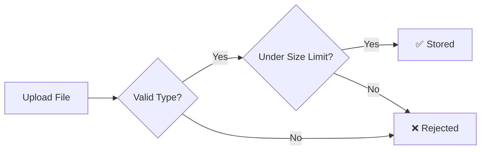

Upload, organize, and manage files across your agency workspace. Files can be attached to projects, tasks, or stored in the agency-wide file browser.

---

## Uploading Files

### How to Upload

Files can be uploaded in several places:

| Location | How |
|----------|-----|
| **Projects → Files tab** | Drag and drop or click to browse |
| **Task Drawer → Attachments** | Drag and drop or click to browse |
| **Agency Files page** | Drag and drop to the files page |
| **Branding settings** | Logos, favicons, and signatures |
| **Invoice signatures** | Signature images |

All uploads use a simple **drag-and-drop** interface — you can also click the upload area to browse your files.

### Supported Files

File types are validated on upload — only safe, common file types are accepted:

- **Images**: JPG, PNG, GIF, SVG, WebP
- **Documents**: PDF, DOC, DOCX, TXT
- **Spreadsheets**: XLS, XLSX, CSV
- **Archives**: ZIP
- **Media**: MP4, MP3, WAV, WebM

<Callout kind="alert">
Files that don't match an allowed MIME type are rejected on upload. Rename or re-export the file in a supported format.
</Callout>

### Size Limits

- **Maximum file size**: 10 MB per file
- **Branding images** (logos, favicons): Up to **5 MB**
- **Message attachments**: Varies by plan (see [Messaging](./messaging#file-attachments))

> Total storage is limited by your plan. See [Settings](./settings/billing#plans--billing) for storage limits per plan.

---

## Agency Files Page

The **Files** page (accessible from the sidebar) provides an agency-wide file browser.

### Stats Dashboard

At the top of the page, four stat cards show:

| Stat | What It Shows |
|------|--------------|
| **Total Files** | Count of all files across the workspace |
| **Total Size** | Combined storage used |
| **Images** | Number of image files |
| **Documents** | Number of PDF, DOC, and spreadsheet files |

### View Modes

Toggle between three view modes at the top right:

| Mode | Best For |
|------|----------|
| **List** | Compact view — file name, type, size, date, context |
| **Detail** | Thumbnail previews with uploader info |
| **Grid** | Large thumbnail grid for visual browsing |

### Features

| Feature | Description |
|---------|-------------|
| **File list** | All files across projects and tasks |
| **Context breadcrumb** | Shows where each file lives: `Client › Project › Task` or *Direct upload* |
| **Owner info** | Who uploaded each file |
| **File details** | Name, type badge, size, and upload date |
| **Image thumbnails** | Real previews for image files |
| **Download** | Download individual files via signed URLs |
| **Delete** | Remove files (with confirmation dialog) |
| **Bulk delete** | Select multiple files with checkboxes and delete at once |
| **Select all** | Checkbox to select all visible files |

### Filter Sidebar

The left sidebar provides three filter dimensions:

| Filter | Options |
|--------|---------|
| **Source** | All, Project files, Task attachments, Direct uploads |
| **Type** | All, Images, PDFs, Documents |
| **Client** | All, or filter by specific client |

Combine filters with the **search bar** to find files by name.

### Permissions

The Files page is **Owner-only** — accessible through the Tools section of the sidebar.

---

## Project Files

Files uploaded within a project are accessible in the project's **Files** tab:

- All project members can view and download files
- **Pinned files** appear on the project overview page for quick access
- When a file is uploaded, all project members (except the uploader) receive a notification

> **See also:** [Projects](./projects#project-files) for project file management

---

## Task Attachments

Attach files directly to tasks via the task drawer:

- Files are stored both on the task and linked to the parent project
- Accessible from the task drawer's attachments section

---

## Storage Limits by Plan

| Plan | Storage Limit |
|------|:------------:|
| **Free** | 500 MB |
| **Pro** | 10 GB |
| **Enterprise** | 100 GB |

<Callout kind="info">
When approaching your storage limit, consider archiving old files or upgrading your plan.
</Callout>

> **See also:** [Settings](./settings/billing#plans--billing) for plan details and upgrading
