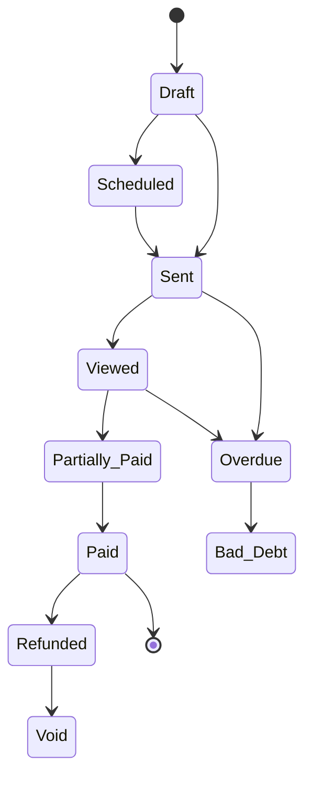

Create professional invoices, track payments, set up recurring billing, issue credit notes, and monitor your agency's financial health.

---

## Creating an Invoice

Navigate to **Invoices** in the sidebar and click **"New Invoice"**.

### Invoice Fields

| Field | Description |
|-------|-------------|
| **Invoice Number** | Auto-generated sequentially (e.g., INV-00001) |
| **Client** | The client organization being billed |
| **Project** | Optionally link to a project |
| **Issue Date** | Date the invoice is created (defaults to today) |
| **Due Date** | Payment deadline |
| **Payment Terms** | Terms text (e.g., "Net 30") |
| **Currency** | Invoice currency (defaults to your agency's default) |
| **Notes** | Client-facing notes |
| **Internal Notes** | Agency-only notes (not visible to clients) |

### Line Items

Each invoice contains line items with:

| Field | Description |
|-------|-------------|
| **Type** | One-Time, Recurring, Usage-Based, Discount, Tax, or Credit |
| **Name & Description** | What you're billing for |
| **Quantity** | Number of units |
| **Unit Price** | Price per unit |
| **Discount** | Per-line discount (percentage or fixed amount) |
| **Tax Rate** | Per-line tax percentage |
| **Service Link** | Optionally link to a service from your catalog |

Line totals are calculated automatically: `(Quantity × Unit Price − Discount) × (1 + Tax Rate)`.

Invoice-level discounts and tax rates can also be applied to the entire invoice.

### Live Preview

As you fill in the invoice form, a **real-time preview** panel shows exactly what the final invoice will look like. The preview uses an **A4 aspect ratio** and updates instantly as you type — including line items, totals, discounts, tax, and your agency branding (logo, accent color, footer).

The same split-panel layout is used for both creating and editing invoices.

### Frozen Billing Snapshot

When an invoice is sent, the client's billing details (name, email, company, address) are **frozen** onto the invoice. This ensures the invoice always reflects the correct billing info at the time it was issued — even if the client's details are updated later.

---

## Invoice Statuses

Invoices flow through the following lifecycle:

| Status | Meaning |
|--------|---------|
| **Draft** | Still being prepared — only drafts can be deleted |
| **Scheduled** | Set to send automatically on a future date |
| **Sent** | Delivered to the client |
| **Viewed** | The client has opened the invoice |
| **Partially Paid** | Some payment has been received |
| **Paid** | Fully paid |
| **Overdue** | Past due date without full payment |
| **Bad Debt** | Marked as uncollectable |
| **Void** | Cancelled / invalidated |
| **Refunded** | Payment has been fully refunded |

---

## Sending Invoices

Once an invoice is ready, click **"Send"** to deliver it to the client's contacts. You can also:

- **Schedule** an invoice for future delivery
- **Share via public link** — generate a shareable URL for clients to view the invoice without logging in

When an invoice is sent:
- All contacts linked to the client organization receive a notification
- A **branded PDF** of the invoice is attached to the email automatically
- The invoice uses your agency's branding (logo, accent color, footer, signature)

---

## Edit Lock

<Callout kind="alert">
Once an invoice is **fully paid**, it becomes read-only — you cannot edit invoice details or line items. Internal notes can still be updated. To modify a paid invoice, issue a credit note or refund instead.
</Callout>

---

## Duplicate & Delete

- **Duplicate** any invoice to create a copy with a new invoice number
- **Delete** is only available for Draft invoices — once sent, invoices must be voided instead
- **Void** requires a reason (e.g., "Duplicate", "Issued in error") — tracked in the invoice history
- **Bad Debt** also requires a reason — marks the invoice as uncollectable for reporting purposes

---

## Permissions

| Permission | What It Allows |
|-----------|---------------|
| **View Invoices** | List, view details, see statistics and analytics |
| **Create Invoices** | Create new invoices and duplicates |
| **Edit Invoices** | Update invoice details and line items |
| **Send Invoices** | Send invoices to clients |
| **Void Invoices** | Void an invoice |
| **Delete Invoices** | Delete draft invoices |
| **Record Payments** | Record and delete payments, apply credit notes |
| **Mark Bad Debt** | Mark invoices as uncollectable |
| **Issue Refunds** | Issue refunds and create credit notes |

> **See also:** [Team](../team) for configuring role permissions
