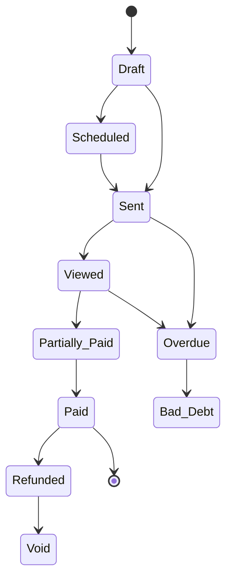

Create professional invoices, track payments, set up recurring billing, issue credit notes, and monitor your agency's financial health.

---

## Creating an Invoice

Navigate to **Invoices** in the sidebar and click **"New Invoice"**.

### Invoice Fields

| Field | Description |
|-------|-------------|
| **Invoice Number** | Auto-generated sequentially (e.g., INV-00001). Prefix, padding, and counter are configurable in agency settings |
| **Client** | The client organization being billed |
| **Project** | Optionally link to a project |
| **Issue Date** | Date the invoice is created (defaults to today) |
| **Due Date** | Payment deadline |
| **Payment Terms** | Terms text (e.g., "Net 30") — selecting terms auto-calculates the due date |
| **Currency** | Invoice currency (defaults to your agency's default) |
| **Notes** | Client-facing notes |
| **Internal Notes** | Agency-only notes (not visible to clients) |

### Invoice Defaults

Configure default values for new invoices under **Settings → Branding → Invoices**:

| Setting | Description |
|---------|-------------|
| **Invoice Prefix** | Prefix for numbering (e.g., "INV", "PRJ") |
| **Counter Padding** | Zero-padding width (3–8 digits) |
| **Default Payment Terms** | Terms applied to new invoices |
| **Default Tax Rate** | Tax rate applied to new invoices |
| **Tax Label** | Label for the tax line (e.g., "GST", "VAT", "Tax") |
| **Late Fee Policy** | Display-only late fee policy text |

### Line Items

Each invoice contains line items with:

| Field | Description |
|-------|-------------|
| **Type** | One-Time, Recurring, Usage-Based, Discount, Tax, or Credit |
| **Name & Description** | What you're billing for |
| **Quantity** | Number of units |
| **Unit Price** | Price per unit |
| **Discount** | Per-line discount (percentage or fixed amount) |
| **Tax Rate** | Per-line tax percentage |
| **Service Link** | Optionally link to a service from your catalog |

Line totals are calculated automatically: `(Quantity × Unit Price − Discount) × (1 + Tax Rate)`.

Line items support **drag-and-drop reorder** to arrange them in your preferred order. Invoice-level discounts and tax rates can also be applied to the entire invoice.

### Live Preview

As you fill in the invoice form, a **real-time preview** panel shows exactly what the final invoice will look like. The preview uses an **A4 aspect ratio** and updates instantly as you type — including line items, totals, discounts, tax, and your agency branding (logo, accent color, footer).

The same split-panel layout is used for both creating and editing invoices.

### Frozen Billing Snapshot

When an invoice is sent, the client's billing details (name, email, company, address) are **frozen** onto the invoice. This ensures the invoice always reflects the correct billing info at the time it was issued — even if the client's details are updated later.

---

## Invoice Statuses

Invoices flow through the following lifecycle:

| Status | Meaning |
|--------|---------|
| **Draft** | Still being prepared — only drafts can be deleted |
| **Scheduled** | Set to send automatically on a future date |
| **Sent** | Delivered to the client |
| **Viewed** | The client has opened the invoice (auto-detected) |
| **Partially Paid** | Some payment has been received |
| **Paid** | Fully paid |
| **Overdue** | Past due date without full payment |
| **Bad Debt** | Marked as uncollectable |
| **Void** | Cancelled / invalidated |
| **Refunded** | Payment has been fully refunded |

<Callout kind="info">
When a client portal user views an invoice, the status automatically transitions from **Sent** to **Viewed** — the invoice creator and agency owners are notified.
</Callout>

### Role-Aware Status Labels

Client portal users see "**Received**" instead of "Sent" for invoices — making the label contextual to their perspective. All other statuses display the same label for both sides.

---

## Sending Invoices

Once an invoice is ready, click **"Send"** to deliver it to the client's contacts. You can also:

- **Schedule** an invoice for future delivery
- **Share via public link** — generate a shareable URL for clients to view and pay the invoice without logging in

When an invoice is sent:
- All contacts linked to the client organization receive a notification
- A **branded PDF** of the invoice is attached to the email automatically
- The invoice uses your agency's branding (logo, accent color, footer, signature)

### Public Payment Link

Each invoice gets a unique public link that clients can use to view the invoice and pay via Stripe — without needing a portal login. The public page displays:

- Full invoice details with line items and totals
- Your agency logo and branding
- A **"Pay"** button (when Stripe is connected and the invoice isn't already paid or voided)
- Partial payment support (when enabled)

---

## Partial Payments

Allow clients to pay a portion of an invoice via Stripe:

1. Enable **"Allow Partial Payment"** when creating or editing an invoice
2. Set the **minimum payment percentage** (default: 25%)
3. Clients see an amount input on the payment page with min/max constraints
4. Each partial payment transitions the invoice to **Partially Paid**
5. Recurring invoice templates inherit these settings automatically

<Callout kind="info">
Agency-side "Record Payment" allows any positive amount regardless of the partial payment toggle — the minimum percentage only applies to client-side Stripe payments.
</Callout>

---

## Generate Invoice from Time Entries

Create invoices directly from tracked time on a project's **Budget & Time** tab:

<Steps>
<Step title="Click Generate Invoice" icon="file-plus">
On the Budget & Time tab, click **"Generate Invoice"** (shows unbilled entry count)
</Step>
<Step title="Configure" icon="settings">
Select date range, grouping (Per Task, Per Member, or Single Line), and hourly rate
</Step>
<Step title="Preview" icon="eye">
See matching entry count, total hours, and estimated total
</Step>
<Step title="Generate Draft" icon="check-circle">
Creates a DRAFT invoice, links all matching entries, and redirects to the invoice
</Step>
</Steps>

Linked time entries are automatically displayed on the invoice detail page. Deleting the draft invoice unlocks the entries so they can be re-billed.

> **See also:** [Contracts & Services](../clients/contracts#time--billing) for organization-level time billing across all projects

---

## Edit Lock

<Callout kind="alert">
Once an invoice is **fully paid**, it becomes read-only — you cannot edit invoice details or line items. Internal notes can still be updated. To modify a paid invoice, issue a credit note or refund instead.
</Callout>

---

## Duplicate & Delete

- **Duplicate** any invoice to create a copy with a new invoice number
- **Delete** is only available for Draft invoices — once sent, invoices must be voided instead
- **Void** requires a reason (e.g., "Duplicate", "Issued in error") — tracked in the invoice history
- **Bad Debt** also requires a reason — marks the invoice as uncollectable for reporting purposes

---

## Permissions

| Permission | What It Allows |
|-----------|---------------|
| **View Invoices** | List, view details, see statistics and analytics |
| **Create Invoices** | Create new invoices and duplicates |
| **Edit Invoices** | Update invoice details and line items |
| **Send Invoices** | Send invoices to clients |
| **Void Invoices** | Void an invoice |
| **Delete Invoices** | Delete draft invoices |
| **Record Payments** | Record and delete payments, apply credit notes |
| **Mark Bad Debt** | Mark invoices as uncollectable |
| **Issue Refunds** | Issue refunds and create credit notes |

<Callout kind="tip">
Use custom roles to fine-tune invoice permissions for your team. For example, give Project Managers **View** access but restrict **Send** and **Record Payments** to Owners and Accountants.
</Callout>

---

## Related

<Columns cols="3">
<Card title="Payments & Credits" icon="credit-card" href="./payments">
Record payments, issue credit notes, and process refunds.
</Card>
<Card title="Recurring Invoices" icon="repeat" href="./recurring">
Automate billing with scheduled invoice generation.
</Card>
<Card title="Analytics & Branding" icon="bar-chart" href="./analytics">
Track financial metrics and customize invoice appearance.
</Card>
</Columns>
