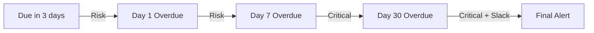

Stay informed about what's happening in your workspace through bell notifications, email alerts, digest summaries, and Slack integration.

---

## Bell Notifications

The bell icon () in the top-right of every page shows your notification count. Click it to open the notification panel.

- **Unread badge** — Shows the number of unread notifications
- **Mark as read** — Click a notification to mark it as read
- **Mark all read** — Clear all unread items at once
- **Navigate** — Click a notification to jump directly to the relevant task, invoice, project, or other item

---

## Email Notifications

Notifications can also be delivered via email, depending on your preferences and the notification type.

### Delivery Modes

| Mode | How It Works |
|------|-------------|
| **Instant** | Email sent immediately when the event occurs |
| **Daily Digest** | Summary email sent once a day (8:00 AM) |
| **Weekly Digest** | Summary email sent weekly on Mondays |

Default delivery mode depends on your role:

| Role | Default Mode |
|------|-------------|
| Owner, Admin, PM, Organization Owner | Instant |
| Accountant, Team Member, Organization Member | Daily Digest |

You can change your preference in **Settings → Account → Notifications**.

### Per-Category Email Control

Toggle email delivery on or off for each notification category independently. This lets you receive bell notifications for everything but limit emails to what matters most.

### Branded Emails

All notification emails are branded with your agency's logo, colors, signature, and social links. They include:

- A "View in Dashboard" button linking directly to the item
- A one-click **unsubscribe** link at the bottom (CAN-SPAM compliant)

> Email notifications require SMTP to be configured. See [Settings](./settings#email-smtp-setup).

---

## Priority Levels

Notifications are categorized by priority to help you focus on what matters:

| Priority | Meaning | Behavior |
|----------|---------|----------|
| ● **Critical (P1)** | Financial loss, system failure, operational breakdown | Always instant — bypasses digest and quiet hours |
| ● **Risk (P2)** | Trending toward a problem — needs attention soon | Instant for agency staff, respects quiet hours for clients |
| ● **Action Required (P3)** | You need to do something specific | Normal delivery, respects digest settings |
| ○ **Informational (P4)** | Lifecycle updates and context | Collapsible, digestable, low visual weight |

### Critical Events (Always Instant)

These events bypass all batching and quiet hours:
- Payment failed
- Automation failed
- Project delayed
- Invoice overdue
- Task overdue batch
- Budget threshold reached
- Contract expiring
- Client health changed to Churn Risk

---

## Notification Categories

Notifications are grouped into categories that you can manage individually:

<ExpandableGroup>
<Expandable title="Tasks & Comments">

| Category | Example Events |
|----------|---------------|
| **Task Assigned** | Task assigned or reassigned to you |
| **Task Status Changed** | Task completed, subtask done, checklist completed, file uploaded |
| **Comments & Mentions** | New comment, reply, reaction, @mention |
| **Deadline Approaching** | Task or project due soon |
| **Time Tracking** | Time logged on your tasks by others |

</Expandable>
<Expandable title="Invoices & Payments">

| Category | Example Events |
|----------|---------------|
| **Invoice Created** | Invoice sent or updated |
| **Invoice Paid** | Payment recorded (partial or full) |
| **Invoice Overdue** | Invoice past due |
| **Invoice Viewed** | Client opened the invoice |
| **Payment Failed** | Payment processing failure |
| **Recurring Generated** | Recurring invoice auto-generated |

</Expandable>
<Expandable title="Projects">

| Category | Example Events |
|----------|---------------|
| **Project Lifecycle** | Project completed, status changed, delayed |
| **Milestone Completed** | Project milestone reached |
| **Project Membership** | Added or removed from a project |
| **Budget Alert** | Project budget at ≥80% utilization |
| **Project Docs** | Documents created or updated |

</Expandable>
<Expandable title="Clients & Services">

| Category | Example Events |
|----------|---------------|
| **Follow-Up Reminders** | CRM follow-up due or overdue |
| **Contract Expiring** | Client contract approaching expiry |
| **Client Health Changed** | Client health score changed significantly |
| **Service Purchased** | Client purchased, reviewed, or activated a service. Hours/credits depleted |
| **Service Cancelled** | Client cancelled a subscription |

</Expandable>
<Expandable title="Operations & Chat">

| Category | Example Events |
|----------|---------------|
| **Team Updates** | Role changed, member removed |
| **Automation Failed** | Automation rule execution failed |
| **Plan Updates** | Subscription plan changes (trial ending, payment issues) |
| **Chat & Messaging** | @mentions in chat, replies to your messages, reactions to your messages |

</Expandable>
</ExpandableGroup>

Not every role sees every category — only relevant categories appear in your settings.

---

## Smart Grouping

To prevent notification overload, similar events are automatically grouped:

| Pattern | Instead of... | You see... |
|---------|--------------|------------|
| Same type + same item + same day | 5 separate "time logged" on Task A | "5 time entries logged on Task A today" |
| Batch events | 3 separate "task due tomorrow" alerts | "3 tasks due tomorrow" |
| Multiple updates on one project | Member added + File uploaded + Status changed | "Project Alpha updated (3 changes today)" |

Additionally, a **24-hour cooldown** prevents duplicate notifications of the same type for the same item.

---

## Quiet Hours

Set a quiet period when non-critical notifications won't be delivered via email:

- Configure **start time** and **end time** in your notification settings
- Critical events (P1) **always** bypass quiet hours
- Bell notifications are still stored — you'll see them when you log in

---

## Notification Scope

Control how broadly you want to be notified:

| Scope | What You Receive |
|-------|-----------------|
| **All** | Notifications for everything in the workspace |
| **Only Mine** | Only notifications where you're directly involved |
| **My Projects** | Notifications for projects you're a member of |

Organization users (client contacts) always see notifications scoped to their organization.

---

## Escalation

Certain events escalate in severity over time:

### Invoice Escalation
- Due in 3 days → Risk notification
- Day 1 overdue → Risk notification 
- Day 7 overdue → Upgraded to **Critical**
- Day 30 overdue → Critical with optional Slack alert

### Project Delay Escalation
- Days 1-6 past deadline → Risk notification
- Day 7+ past deadline → Upgraded to **Critical**

### Client Health Escalation
- Healthy → At Risk → Risk notification
- At Risk → Churn Risk → Upgraded to **Critical**

---

## Slack Integration

Send notifications to a Slack channel via webhook:

1. Go to **Settings → Agency → Integrations → Slack**
2. Enter your Slack **webhook URL**
3. Choose which notification categories to send to Slack

Slack notifications are delivered in addition to bell and email notifications.

> **See also:** [Settings](./settings#integrations) for Slack setup

---

## Changelog Notifications

When a new platform version is released, you'll see a changelog notification in your bell. These are informational and can be dismissed — they won't reappear after 7 days.

---

## Platform Emails (Non-Bell)

Some emails are sent outside the notification bell system:

| Email | When It's Sent |
|-------|---------------|
| **Welcome Email** | When you register a new agency |
| **Password Reset** | When you request a password reset |
| **Invitation Email** | When you're invited to join a workspace |

These are direct emails and don't appear in the notification panel.

### Hourly Chat Digest

If you've been away from the platform for more than 10 minutes, an **hourly chat digest** email summarizes any unread messages across your channels. This runs in addition to your regular notification digest settings.

> **See also:** [Messaging](./messaging) for full messaging and notification details

> **See also:** [Settings](./settings#notification-preferences) for configuring your notification preferences
