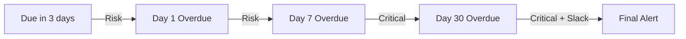

## Escalation

Certain events escalate in severity over time:

### Invoice Escalation
- Due in 3 days → Risk notification
- Day 1 overdue → Risk notification 
- Day 7 overdue → Upgraded to **Critical**
- Day 30 overdue → Critical with optional Slack alert

### Project Delay Escalation
- Days 1-6 past deadline → Risk notification
- Day 7+ past deadline → Upgraded to **Critical**

### Client Health Escalation
- Healthy → At Risk → Risk notification
- At Risk → Churn Risk → Upgraded to **Critical**

---

## Slack Integration

Send notifications to Slack channels via incoming webhooks. Slack notifications are delivered in addition to bell and email notifications — keeping your team informed without leaving Slack.

### Basic Setup

<Steps>
<Step title="Get a webhook URL" icon="link">
Create an incoming webhook in your Slack workspace (via Slack's app directory)
</Step>
<Step title="Configure in settings" icon="settings">
Go to **Settings → Agency → Integrations → Slack** and paste your webhook URL
</Step>
<Step title="Choose categories" icon="toggle-left">
Enable which notification categories should be sent to Slack
</Step>
<Step title="Test" icon="zap">
Click **"Send Test"** to verify your webhook is working
</Step>
</Steps>

### Notification Format

Slack notifications use **Block Kit** formatting with:

- **Priority-colored sidebar** — Red (critical), Orange (important), Blue (standard), Grey (info)
- **Emoji prefix** — 🚨 Critical, ⚠️ Important, 🔔 Standard, 📋 Info
- **Deep link button** — "View in EidonCore" links directly to the relevant page

### Multi-Channel Routing (Pro+)

Route different notification categories to different Slack channels. For example:

- Invoice notifications → `#finance` channel
- Task assignments → `#dev-team` channel
- Client messages → `#client-comms` channel

Categories without a specific channel mapping fall back to your default webhook.

### Available Categories (27)

| Area | Categories |
|------|------------|
| **Tasks** | Task assigned, status changed, comment mention, time tracking |
| **Projects** | Lifecycle, milestone completed, membership, delays, deadlines, budget alerts, docs |
| **Invoices** | Created, paid, overdue, viewed, payment failed, recurring generated |
| **CRM** | Client message, health changed, follow-up reminder, contract expiring |
| **Team** | Team updates |
| **Automations** | Failed, service purchased, service cancelled |
| **Platform** | Plan updates, bug report updates |

### Executive Digests (Pro+)

Receive automated summary reports in Slack:

| Digest | Frequency | What It Includes |
|--------|-----------|-----------------|
| **Daily** | Every morning | Revenue today, outstanding amount, overdue invoices, active projects (off-track count), overdue tasks, team load |
| **Weekly KPI** | Monday morning | Weekly revenue, collection rate, task completion %, overdue invoices, off-track projects |

Configure digests in **Settings → Agency → Integrations → Slack** under the Digests section.

### Automation Action

The automation engine supports **Send Slack Message** as an action type. When an automation trigger fires, it can send a custom Slack message to your configured channel — with support for variable substitution in the title and message body.

<Callout kind="info">
**Plan availability:** Basic Slack webhook integration is available on all plans. Multi-channel routing and executive digests require a **Pro** plan or higher.
</Callout>

> **See also:** [Automations](../automations) for automation triggers and actions · [Settings](../settings/roles#integrations) for Slack setup

---

## Changelog Notifications

When a new platform version is released, you'll see a changelog notification in your bell. These are informational and can be dismissed — they won't reappear after 7 days.

---

## Platform Emails (Non-Bell)

Some emails are sent outside the notification bell system:

| Email | When It's Sent |
|-------|---------------|
| **Welcome Email** | When you register a new agency |
| **Password Reset** | When you request a password reset |
| **Invitation Email** | When you're invited to join a workspace |

These are direct emails and don't appear in the notification panel.

### Hourly Chat Digest

If you've been away from the platform for more than 10 minutes, an **hourly chat digest** email summarizes any unread messages across your channels. This runs in addition to your regular notification digest settings.

---

## Push Notifications

Enable browser push notifications to receive real-time alerts even when the platform tab is in the background:

1. Click the **bell icon** in the top navigation
2. Allow browser push notification permissions when prompted
3. Push notifications will appear as native system notifications

Push notifications work alongside in-app bell notifications — they're not a replacement. Both can be enabled simultaneously.

### PWA Install

The platform can be installed as a **Progressive Web App (PWA)** on desktop and mobile for a native app experience:

- **Desktop** — Use your browser's "Install App" option (appears in the address bar)
- **Mobile** — Use "Add to Home Screen" from your browser's menu

The installed PWA supports:
- Offline caching for recently viewed pages
- Background sync for pending actions
- Push notifications (when enabled)
- Full-screen mode without browser chrome

> **See also:** [Messaging](../messaging) for full messaging and notification details

> **See also:** [Settings](../settings/overview#notification-preferences) for configuring your notification preferences
