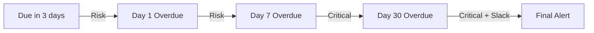

## Escalation

Certain events escalate in severity over time:

### Invoice Escalation
- Due in 3 days → Risk notification
- Day 1 overdue → Risk notification 
- Day 7 overdue → Upgraded to **Critical**
- Day 30 overdue → Critical with optional Slack alert

### Project Delay Escalation
- Days 1-6 past deadline → Risk notification
- Day 7+ past deadline → Upgraded to **Critical**

### Client Health Escalation
- Healthy → At Risk → Risk notification
- At Risk → Churn Risk → Upgraded to **Critical**

---

## Slack Integration

Send notifications to a Slack channel via webhook:

1. Go to **Settings → Agency → Integrations → Slack**
2. Enter your Slack **webhook URL**
3. Choose which notification categories to send to Slack

Slack notifications are delivered in addition to bell and email notifications.

> **See also:** [Settings](../settings/roles#integrations) for Slack setup

---

## Changelog Notifications

When a new platform version is released, you'll see a changelog notification in your bell. These are informational and can be dismissed — they won't reappear after 7 days.

---

## Platform Emails (Non-Bell)

Some emails are sent outside the notification bell system:

| Email | When It's Sent |
|-------|---------------|
| **Welcome Email** | When you register a new agency |
| **Password Reset** | When you request a password reset |
| **Invitation Email** | When you're invited to join a workspace |

These are direct emails and don't appear in the notification panel.

### Hourly Chat Digest

If you've been away from the platform for more than 10 minutes, an **hourly chat digest** email summarizes any unread messages across your channels. This runs in addition to your regular notification digest settings.

> **See also:** [Messaging](../messaging) for full messaging and notification details

> **See also:** [Settings](../settings/overview#notification-preferences) for configuring your notification preferences
