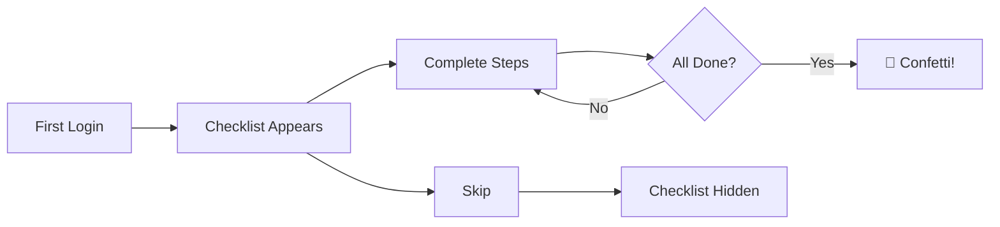

When you first log in, a personalized **setup checklist** appears at the top of your dashboard. It guides you through the most important first steps based on your role, helping you get the most out of the platform quickly.

---

## How It Works

<Steps>
<Step title="Checklist appears" icon="layout">
After your first login, the checklist appears on your dashboard
</Step>
<Step title="Follow the steps" icon="external-link">
Each step links to the relevant page — click to get started
</Step>
<Step title="Progress auto-detected" icon="check-circle">
When you complete an action (e.g., create your first project), the step is automatically checked off
</Step>
<Step title="Track your progress" icon="pie-chart">
A **progress ring** shows your completion percentage
</Step>
<Step title="Celebrate completion" icon="party-popper">
When all steps are complete, a confetti animation plays and the checklist collapses
</Step>
</Steps>
<Callout kind="tip">
You can **skip** the checklist at any time — it won't come back unless you re-show it from your profile settings.
</Callout>

---

## Steps by Role

The checklist is tailored to your role so you see only the most relevant setup tasks:

### Agency Owner
| Step | Action |
|------|--------|
| — **Set up branding** | Add your agency logo, colors, and brand name |
| — **Invite your team** | Add your first team member |
| — **Add a client** | Create your first client organization |
| — **Create a service** | Set up your first service in the catalog |
| — **Create an invoice** | Send your first invoice |

### Admin / Project Manager
| Step | Action |
|------|--------|
| — **Add a client** | Create a client organization |
| — **Create a project** | Start your first project |
| ✓ **Create tasks** | Add tasks to a project |
| — **Review your team** | Check team members and roles |

### Accountant
| Step | Action |
|------|--------|
| — **Create an invoice** | Set up your first invoice |
| — **Explore reports** | Review the financial reports |
| — **Customize your profile** | Add your name and avatar |

### Team Member
| Step | Action |
|------|--------|
| ✓ **Check your tasks** | View tasks assigned to you |
| — **Explore projects** | Browse projects you're a member of |
| — **Customize your profile** | Add your name and avatar |

### Client Users (Organization Owner / Member)
| Step | Action |
|------|--------|
| — **View your projects** | See the projects assigned to your organization |
| ✓ **Browse your tasks** | Check tasks in your projects |
| — **Explore services** | Browse available services in the catalog |
| — **View invoices** | Review invoices billed to your organization |

---

## Dismissing the Checklist

You have two options:

- **Complete all steps** — the checklist automatically celebrates your progress with a confetti animation and collapses after 3 seconds
- **Skip** — click the dismiss/skip button to hide the checklist permanently

Either way, the checklist won't reappear on future visits.

---

## Re-Showing the Checklist

Changed your mind? You can bring the checklist back:

1. Go to **Settings → Account → Profile**
2. Click **"Re-show setup guide"**
3. The checklist will appear on your dashboard again with your previous progress preserved

---

## Notes

- The checklist only covers **core features** available on all plans — plan-specific features (Automations, Intake Forms, Advanced Reports) are not included in onboarding
- Each user gets their own independent checklist — completing steps on one user's checklist doesn't affect anyone else's
- Steps auto-detect completion server-side, so your progress is always accurate even if you completed an action before seeing the checklist

> **See also:** [Getting Started](./getting-started) for registration and first login · [Dashboard](./dashboard) for your dashboard overview · [Settings](./settings/overview#account-settings) for profile customization
