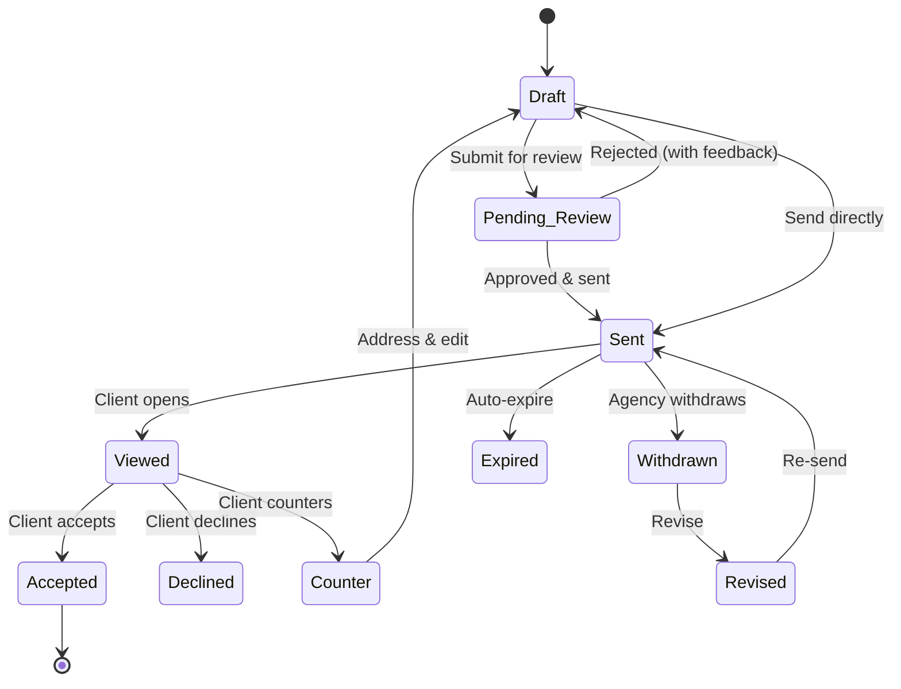

Create professional, branded proposals and deliver them to clients for review, acceptance, or negotiation. The proposal builder supports rich content blocks, line item pricing, client signatures, version tracking, and automatic conversion to projects and invoices.

<Columns cols="2">
<Card title="Create & Build" icon="file-text" href="#creating-a-proposal">
Design proposals with 18+ content block types and line item pricing
</Card>
<Card title="Deliver & Track" icon="send" href="#sending-a-proposal">
Send proposals, track views, and monitor engagement analytics
</Card>
<Card title="Client Actions" icon="pen-tool" href="#client-actions">
Clients can accept, decline, counter, or request extensions
</Card>
<Card title="Convert & Bill" icon="refresh-cw" href="#converting-accepted-proposals">
Turn accepted proposals into projects and invoices automatically
</Card>
</Columns>

---

## Creating a Proposal

Navigate to **Proposals** in the sidebar and click **"New Proposal"** (or press `N`).

### Proposal Details

| Field | Description |
|-------|-------------|
| **Title** | A descriptive proposal title |
| **Client** | The client organization this proposal is for |
| **Template** | Optionally start from a saved proposal template |
| **Currency** | Currency for pricing (defaults to USD) |
| **Expiry** | Number of days the proposal remains valid (default: 30 days) |

<Callout kind="tip">
Use **proposal templates** to save time on frequently-sent proposals. Templates preserve the full block structure, line items, and settings so you can reuse them.
</Callout>

---

## Proposal Builder

The proposal builder uses a **block-based editor** — add, reorder, and customize content blocks to build your proposal. Changes are **auto-saved** with a debounce delay, so you never lose work.

### Content Block Types

| Block | Purpose |
|-------|---------|
| **Heading** | Section headings (H1–H3) |
| **Text** | Rich text paragraphs |
| **Image** | Uploaded images with captions |
| **Divider** | Visual separator line |
| **Spacer** | Vertical spacing |
| **Pricing Table** | Line item pricing (qty, unit price, discounts, tax) |
| **Total Summary** | Subtotal, discount, tax, and grand total |
| **Scope of Work** | Rich text scope description |
| **Timeline** | Project timeline and milestones |
| **Terms** | Terms and conditions |
| **Signature** | Client signature capture area |
| **Deliverables** | Deliverables checklist |
| **Testimonial** | Client testimonial quote |
| **Case Study** | Past project showcase |
| **Attachments** | File attachments |
| **Video** | Embedded video (YouTube, Vimeo, Loom) |
| **Team Bios** | Team member cards with bios |
| **Pricing Configurator** | Interactive pricing option selector |

---

## Line Items & Pricing

The **Line Items** tab lets you manage individual pricing entries for your proposal.

### Adding Line Items

You can add line items in two ways:

- **Manual items** — Enter a custom name, quantity, unit price, and optional discount or tax
- **From Service Catalog** — Click **"Add from catalog"** to pull in services with their configured pricing. Billing type badges show whether an item is recurring (/mo, /yr), hourly (/hr), or one-time

### Line Item Features

| Feature | Description |
|---------|-------------|
| **Quantity & Unit Price** | Set the quantity and per-unit price |
| **Discounts** | Per-item percentage or fixed discount |
| **Tax** | Per-item or proposal-level tax rate |
| **Optional Items** | Mark items as optional — clients choose whether to include them during acceptance |
| **Billing Type Badges** | Visual indicators: **RECURRING**, **SERVICE**, **ONE-TIME** |

### Pricing Summary

The proposal automatically calculates:

- **Subtotal** — sum of all non-optional accepted items
- **Discount** — document-level percentage or fixed discount
- **Tax** — applied to subtotal after discount
- **Grand Total** — final amount

<Callout kind="info">
When a client accepts a proposal with optional items, the totals are **recalculated** based on which optional items they selected.
</Callout>

---

## Proposal Lifecycle

Proposals follow a structured lifecycle from creation to completion:

### Statuses

| Status | Meaning |
|--------|---------|
| **Draft** | Work in progress — not yet sent to the client |
| **Pending Review** | Submitted for internal review before sending |
| **Sent** | Delivered to the client and awaiting response |
| **Viewed** | Client has opened and viewed the proposal |
| **Accepted** | Client has accepted and signed |
| **Declined** | Client has declined (with reason) |
| **Counter** | Client submitted a counter-proposal |
| **Expired** | Past the expiry date without a response |
| **Withdrawn** | Agency pulled back the proposal |
| **Revised** | Updated version created (linked to previous version) |

---

## Internal Review

For team oversight, proposals can be submitted for **internal review** before sending to the client:

<Steps>
<Step title="Submit for review" icon="send">
The proposal creator submits it for review. Status changes to **Pending Review**.
</Step>
<Step title="Review & decision" icon="check-circle">
An Owner or Admin reviews the proposal and either **approves** it (ready to send) or **rejects** it with feedback (returns to Draft).
</Step>
<Step title="Send to client" icon="mail">
Once approved, the proposal can be sent to the client.
</Step>
</Steps>

---

## Sending a Proposal

When you send a proposal, the client contacts associated with the organization receive a notification and email with the proposal attached as a PDF.

### Scheduling

You can schedule proposals to be sent at a specific date and time in the future. The system automatically sends the proposal at the scheduled time.

### Reminders

Send reminder notifications to clients who haven't yet responded to a proposal.

### Share Links

Sent proposals have a **public share link** that you can copy and send directly to anyone — no login required.

---

## Client Actions

When a client receives a proposal, they can take the following actions:

### Accept & Sign

Clients review the proposal, select any optional items, then accept and sign. The signature can be:

- **Typed** — enter their name as a signature
- **Drawn** — draw a signature on an ink canvas

The acceptance records the client's name, signature, IP address, and timestamp for a complete audit trail.

### Decline

Clients can decline a proposal with a reason, which is sent back to the agency.

### Counter-Proposal

Clients can submit a **counter-proposal** with a message explaining their requested changes. The agency can then address the counter by editing the proposal and re-sending.

### Request Extension

If a proposal is close to expiring, the client can **request an extension**. The agency can approve or deny the extension request.

---

## Analytics

The **Analytics** tab on any proposal shows engagement data:

| Metric | Description |
|--------|-------------|
| **Total Views** | How many times the proposal has been viewed |
| **Average View Time** | How long clients spend reading |
| **Time to First View** | How quickly the client opened the proposal after it was sent |
| **Time to Decision** | How long between first view and acceptance/decline |
| **Device Breakdown** | Which devices clients used to view the proposal |
| **View Timeline** | Chart showing when views occurred |

---

## Version History

When you **revise** a withdrawn or counter-addressed proposal, a new version is created. The system maintains a linked chain of versions so you can compare changes between versions.

---

## Converting Accepted Proposals

Once a proposal is accepted, you can convert it into actionable work:

| Conversion | What It Creates |
|-----------|----------------|
| **To Project** | A new project with the client organization linked |
| **To Invoice** | A draft invoice with the line items from the proposal |
| **To Both** | Both a project and an invoice simultaneously |
| **Multi-Invoice** | Multiple milestone-based invoices from a payment schedule |

### Auto-Conversion

You can configure proposals to **automatically convert** when the client accepts:

| Setting | Behavior |
|---------|----------|
| **Manual** | No automation — you convert manually |
| **Auto → Project** | Automatically creates a project on acceptance |
| **Auto → Invoice** | Automatically creates an invoice and redirects the client to pay via Stripe |
| **Auto → Both** | Creates both a project and invoice, with Stripe checkout redirect |

<Callout kind="info">
When auto-conversion is set to create an invoice, the client is **redirected to Stripe Checkout** immediately after accepting. If the client doesn't complete payment, the invoice remains as a draft and can be sent manually later.
</Callout>

### Service-Linked Line Items

If you add line items from your **Service Catalog**, converting the proposal to an invoice will automatically:

- Create invoice line items for each service
- **Provision active subscriptions** for recurring services (e.g., monthly hosting, annual licenses)
- Set up automatic billing for recurring items

This means a single proposal can combine one-time project fees with ongoing service subscriptions.

### Deposits

Enable **deposit payments** on a proposal to split the payment:

- **Percentage-based** — e.g., 50% upfront, 50% on completion
- **Fixed amount** — e.g., $1,000 deposit, remainder on completion

When converted, the system creates two invoices: one for the deposit (due immediately) and one for the remainder.

---

## Proposal Templates

Save any proposal as a **template** for reuse. Templates preserve:

- All content blocks
- Line item structure
- Proposal settings

Agency Owners and Admins can manage templates. When creating a new proposal, you can start from a template and customize it for the specific client.

---

## Download & Print

| Action | Description |
|--------|-------------|
| **Download PDF** | Download the proposal as a PDF document |
| **Print** | Opens a clean print-ready view of the proposal |
| **Copy Share Link** | Copy the public share URL (available after sending) |

Proposals sent via email include the PDF as an attachment.

---

## Proposal Views

The **Proposals** list page supports two views:

- **Table view** — sortable list with status filter tabs
- **Card view** — visual cards with proposal summaries

Your view preference is saved automatically.

---

## Permissions

| Permission | What It Allows | Default Roles |
|-----------|---------------|---------------|
| **View Proposals** | See proposals (own or all) | Owner, Admin, PM (own only) |
| **Create** | Create new proposals | Owner, Admin, PM |
| **Edit** | Edit proposal content and settings | Owner, Admin, PM (own only) |
| **Send** | Send proposals to clients, approve reviews | Owner, Admin |
| **Delete** | Delete proposals | Owner, Admin |
| **Convert** | Convert accepted proposals to projects/invoices | Owner, Admin |
| **View All** | View all proposals regardless of ownership | Owner, Admin |
| **Manage Templates** | Create, edit, and delete templates | Owner, Admin |

<Callout kind="info">
Proposals is a **Pro plan** feature. Free plan users will see a lock icon on the sidebar item with an upgrade prompt.
</Callout>

> **See also:** [Projects](./projects) for converted project details · [Invoicing](./invoicing/overview) for converted invoice details · [Services](./services/overview) for service-linked proposals · [Keyboard Shortcuts](./keyboard-shortcuts) for proposal page shortcuts
