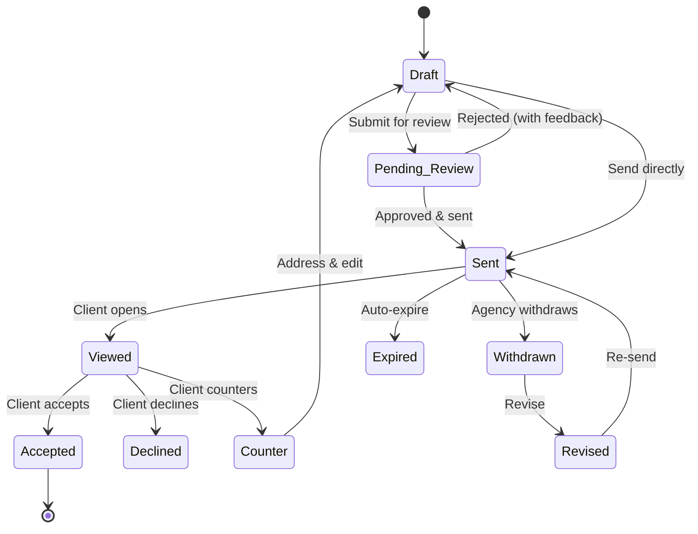

Once a proposal is built, deliver it to clients, track their engagement, and handle their response — all from the proposal detail page.

---

## Proposal Lifecycle

Proposals follow a structured lifecycle from creation to completion:

### Statuses

| Status | Meaning |
|--------|---------|
| **Draft** | Work in progress — not yet sent to the client |
| **Pending Review** | Submitted for internal review before sending |
| **Sent** | Delivered to the client and awaiting response |
| **Viewed** | Client has opened and viewed the proposal |
| **Accepted** | Client has accepted and signed |
| **Declined** | Client has declined (with reason) |
| **Counter** | Client submitted a counter-proposal |
| **Expired** | Past the expiry date without a response |
| **Withdrawn** | Agency pulled back the proposal |
| **Revised** | Updated version created (linked to previous version) |

---

## Internal Review

For team oversight, proposals can be submitted for **internal review** before sending to the client:

<Steps>
<Step title="Submit for review" icon="send">
The proposal creator submits it for review. Status changes to **Pending Review**.
</Step>
<Step title="Review & decision" icon="check-circle">
An Owner or Admin reviews the proposal and either **approves** it (ready to send) or **rejects** it with feedback (returns to Draft).
</Step>
<Step title="Send to client" icon="mail">
Once approved, the proposal can be sent to the client.
</Step>
</Steps>

---

## Sending a Proposal

When you send a proposal, the client contacts associated with the organization receive a notification and email with the proposal attached as a PDF.

### Scheduling

You can schedule proposals to be sent at a specific date and time in the future. The system automatically sends the proposal at the scheduled time.

### Reminders

Send reminder notifications to clients who haven't yet responded to a proposal.

### Share Links

Sent proposals have a **public share link** that you can copy and send directly to anyone — no login required.

---

## Client Actions

When a client receives a proposal, they can take the following actions:

### Accept & Sign

Clients review the proposal, select any optional items, then accept and sign. The signature can be:

- **Typed** — enter their name as a signature
- **Drawn** — draw a signature on an ink canvas

The acceptance records the client's name, signature, IP address, and timestamp for a complete audit trail.

### Decline

Clients can decline a proposal with a reason, which is sent back to the agency.

### Counter-Proposal

Clients can submit a **counter-proposal** with a message explaining their requested changes. The agency can then address the counter by editing the proposal and re-sending.

### Request Extension

If a proposal is close to expiring, the client can **request an extension**. The agency can approve or deny the extension request.

---

## Analytics

The **Analytics** tab on any proposal shows engagement data:

| Metric | Description |
|--------|-------------|
| **Total Views** | How many times the proposal has been viewed |
| **Average View Time** | How long clients spend reading |
| **Time to First View** | How quickly the client opened the proposal after it was sent |
| **Time to Decision** | How long between first view and acceptance/decline |
| **Device Breakdown** | Which devices clients used to view the proposal |
| **View Timeline** | Chart showing when views occurred |

---

## Version History

When you **revise** a withdrawn or counter-addressed proposal, a new version is created. The system maintains a linked chain of versions so you can compare changes between versions.

> **See also:** [Proposal Basics](./proposals/overview) for creating and building proposals · [Conversion & Billing](./proposals/conversion) for turning accepted proposals into projects and invoices
