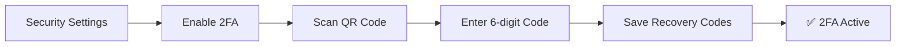

Eidoncore is built with security at every layer. This guide covers the security features available to you and your team.

---

## Data Protection & Encryption

### Encryption at Rest

All sensitive data is encrypted before being stored:

| Data | Protection |
|------|-----------|
| **SMTP passwords** | AES-256-GCM encryption |
| **2FA secrets** | AES-256-GCM encryption |
| **Passwords** | bcrypt hashing (not reversible) |
| **Recovery codes** | bcrypt hashing |

### Encryption in Transit

All connections use **HTTPS/TLS** — data is encrypted between your browser and the platform at all times.

---

## Two-Factor Authentication (2FA)

Add an extra layer of security to your account using an authenticator app.

### Setting Up 2FA

<Steps>
<Step title="Open security settings" icon="settings">
Go to **Settings → Account → Security**
</Step>
<Step title="Enable 2FA" icon="shield">
Click **"Enable Two-Factor Authentication"**
</Step>
<Step title="Scan the QR code" icon="smartphone">
Scan the QR code with your authenticator app (Google Authenticator, Authy, 1Password, etc.)
</Step>
<Step title="Verify" icon="check-circle">
Enter the 6-digit verification code
</Step>
<Step title="Save recovery codes" icon="key">
Save your **8 recovery codes** — store these somewhere safe
</Step>
</Steps>

### Using 2FA

After setup, you'll be asked for a 6-digit code from your authenticator app each time you log in.

### Recovery Codes

If you lose access to your authenticator app, use one of your 8 recovery codes to log in. Each code can only be used once. You can regenerate new codes from security settings (requires recent password verification).

### Disabling 2FA

Disable 2FA in Settings → Account → Security. You'll need to enter your password and a verification code.

### Agency-Wide 2FA

Agency owners can **require all team members** to enable 2FA:

1. Go to **Settings → Agency → Security**
2. Enable **"Require Two-Factor Authentication"**

Team members without 2FA will be prompted to set it up.

> Note: You must have 2FA enabled yourself before requiring it for others.

---

## Session Management

### Viewing Active Sessions

Under **Settings → Account → Security → Active Sessions**, you can see:

| Information | What It Shows |
|------------|--------------|
| **Device** | Device type (desktop, mobile, tablet) |
| **Browser** | Which browser is being used |
| **Operating System** | OS information |
| **Location** | IP-based city and country |
| **Last Active** | When the session was last used |

### Revoking Sessions

- **Revoke a single session** — End a specific login session on another device
- **Revoke all other sessions** — End all sessions except the one you're currently using

This is useful if you suspect unauthorized access or have logged in on a shared device.

### Session Timeouts

Sessions automatically expire after **4 hours** of inactivity. Agency owners can configure additional policies:

<Callout kind="info" collapsed="true" title="Configurable Timeout Policies">

| Policy | Description |
|--------|-------------|
| **Idle Timeout** | Auto-logout after a period of inactivity (up to 24 hours) |
| **Maximum Session Lifetime** | Force re-login after a maximum period (up to 30 days) |

</Callout>

---

## Security Policies

Agency owners can enforce security rules under **Settings → Agency → Security**:

| Policy | What It Does |
|--------|-------------|
| **Require 2FA** | All team members must enable two-factor authentication |
| **Session Idle Timeout** | Auto-logout after inactivity |
| **Max Session Lifetime** | Maximum time before forced re-login |
| **Re-Authentication** | Require password re-entry for sensitive actions (account deletion, MFA changes, backup code regeneration) |
| **Email Domain Allowlist** | Only allow team invites from specific email domains (e.g., `@youragency.com`) |

---

## Password Requirements

All passwords must meet these minimum requirements:

- At least **8 characters** long
- At least **1 uppercase letter**
- At least **1 lowercase letter**
- At least **1 digit**

These requirements apply to registration, password changes, and password resets.

---

## Audit Logging

Every significant action in your workspace is recorded in the audit log:

| Information | What's Tracked |
|------------|---------------|
| **Action** | What happened (e.g., profile updated, role changed, invoice created) |
| **Who** | Which user performed the action |
| **What Changed** | Field-level details of the change |
| **When** | Timestamp |
| **From Where** | IP address and browser information |

Access the audit log under **Settings → Agency → Audit Log**. Filter by action type, actor, or date range.

---

## Security Events

Your security event history tracks authentication-related actions:

| Event | When It's Logged |
|-------|------------------|
| **Login successful** | Each time you log in |
| **Login failed** | Failed login attempt |
| **Password changed** | Password updated |
| **2FA enabled** | Two-factor authentication turned on |
| **2FA disabled** | Two-factor authentication turned off |
| **Re-authentication passed** | Sensitive action password re-entry successful |
| **Recovery codes regenerated** | New backup codes generated |
| **Security policy changed** | Org-wide security settings updated |

Each event records the **IP address** and **browser/device** used. View your security events under **Settings → Account → Security**.

---

## Data Isolation Between Workspaces

Each agency workspace is completely isolated:

- All data is scoped to your organization — no data is shared between workspaces
- Even if the same email address is used across multiple agencies, profile data (name, avatar) is independent per workspace
- Client data, projects, tasks, invoices, and all other records are strictly separated

---

## Protection Against Common Threats

The platform includes built-in protection against:

<ExpandableGroup>
<Expandable title="Authentication Attacks">

| Threat | Protection |
|--------|-----------|
| **Brute Force Attacks** | Rate limiting: 5 login attempts per minute per email, 3 password resets per 10 minutes |
| **Session Hijacking** | Secure, HTTP-only cookies with hostname scoping (no cross-subdomain leaking) |
| **Man-in-the-Middle** | HSTS headers enforcing HTTPS (1-year max-age) |

</Expandable>
<Expandable title="Injection & Forgery">

| Threat | Protection |
|--------|-----------|
| **Cross-Site Scripting (XSS)** | Server-side HTML sanitization + Content Security Policy (CSP) headers |
| **Cross-Site Request Forgery (CSRF)** | Origin header validation with fail-closed policy |
| **Content Injection** | All user-generated HTML sanitized at save-time |

</Expandable>
<Expandable title="Infrastructure">

| Threat | Protection |
|--------|-----------|
| **DNS Spoofing** | DNS-over-HTTPS verification for custom domains |
| **Clickjacking** | X-Frame-Options: DENY |

</Expandable>
</ExpandableGroup>

---

## Custom Domain Security

If you use a custom domain, sessions are automatically scoped to prevent cross-domain leaking:

- **Subdomain access** (`slug.eidoncore.com`) — Sessions are shared across your workspace subdomains
- **Custom domain access** (`app.youragency.com`) — Sessions are scoped to the exact hostname

DNS verification uses secure DNS-over-HTTPS to prevent spoofing.

> **See also:** [Settings](./settings#custom-domains) for setting up custom domains · [Settings](./settings#security-policies) for configuring security policies
