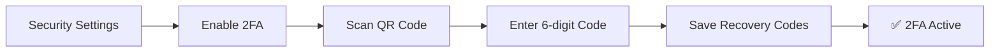

Eidoncore is built with security at every layer. This guide covers the security features available to you and your team.

---

## Data Protection & Encryption

### Encryption at Rest

All sensitive data is encrypted before being stored:

| Data | Protection |
|------|-----------|
| **SMTP passwords** | AES-256-GCM encryption |
| **2FA secrets** | AES-256-GCM encryption |
| **Passwords** | bcrypt hashing (not reversible) |
| **Recovery codes** | bcrypt hashing |

### Encryption in Transit

All connections use **HTTPS/TLS** — data is encrypted between your browser and the platform at all times.

---

## Two-Factor Authentication (2FA)

Add an extra layer of security to your account using an authenticator app.

### Setting Up 2FA

<Steps>
<Step title="Open security settings" icon="settings">
Go to **Settings → Account → Security**
</Step>
<Step title="Enable 2FA" icon="shield">
Click **"Enable Two-Factor Authentication"**
</Step>
<Step title="Scan the QR code" icon="smartphone">
Scan the QR code with your authenticator app (Google Authenticator, Authy, 1Password, etc.)
</Step>
<Step title="Verify" icon="check-circle">
Enter the 6-digit verification code
</Step>
<Step title="Save recovery codes" icon="key">
Save your **8 recovery codes** — store these somewhere safe
</Step>
</Steps>

### Using 2FA

After setup, you'll be asked for a 6-digit code from your authenticator app each time you log in.

### Recovery Codes

If you lose access to your authenticator app, use one of your 8 recovery codes to log in. Each code can only be used once. You can regenerate new codes from security settings (requires recent password verification).

### Disabling 2FA

Disable 2FA in Settings → Account → Security. You'll need to enter your password and a verification code.

### Agency-Wide 2FA

Agency owners can **require all team members** to enable 2FA:

1. Go to **Settings → Agency → Security**
2. Enable **"Require Two-Factor Authentication"**

Team members without 2FA will be prompted to set it up.

> Note: You must have 2FA enabled yourself before requiring it for others.

---

## Session Management

### Viewing Active Sessions

Under **Settings → Account → Security → Active Sessions**, you can see:

| Information | What It Shows |
|------------|--------------|
| **Device** | Device type (desktop, mobile, tablet) |
| **Browser** | Which browser is being used |
| **Operating System** | OS information |
| **Location** | IP-based city and country |
| **Last Active** | When the session was last used |

### Revoking Sessions

- **Revoke a single session** — End a specific login session on another device
- **Revoke all other sessions** — End all sessions except the one you're currently using

This is useful if you suspect unauthorized access or have logged in on a shared device.

### Session Timeouts

Sessions automatically expire after **4 hours** of inactivity. Agency owners can configure additional policies:

<Callout kind="info" collapsed="true" title="Configurable Timeout Policies">

| Policy | Description |
|--------|-------------|
| **Idle Timeout** | Auto-logout after a period of inactivity (up to 24 hours) |
| **Maximum Session Lifetime** | Force re-login after a maximum period (up to 30 days) |

</Callout>

---
