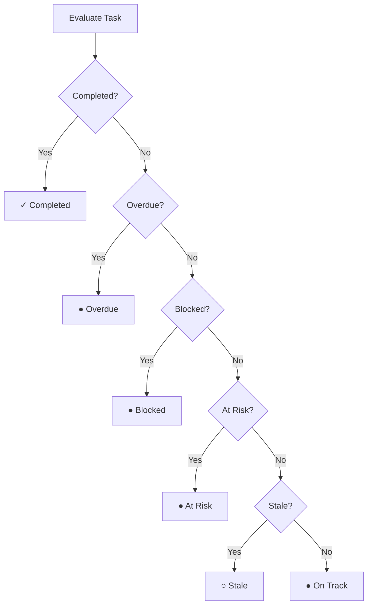

## Task Health

Each task is automatically assessed for health based on its due date, dependencies, and activity:

| Indicator | Condition |
|-----------|-----------|
| ● **On Track** | On schedule, no issues |
| ● **At Risk** | Due within 2 days and still in To Do |
| ● **Overdue** | Past due date and not completed |
| ● **Blocked** | Waiting on a dependency that isn't done |
| ○ **Stale** | No updates for 3+ days while still active |
| ✓ **Completed** | Task is Done |

Health is evaluated in order of severity: Completed → Overdue → Blocked → At Risk → Stale → On Track.

Health indicators appear on the task card and in the task drawer.

---

## Subtasks

Break large tasks into smaller **subtasks**. Subtasks are full tasks linked to a parent task:

- Each subtask has its own status, assignee, and due date
- The parent task shows subtask completion progress
- When a subtask is marked Done, the parent task's assignee and creator are notified

---

## Checklists

Add a checklist to any task for a quick to-do list:

- Check off items as they're completed
- Checklist items support **nesting** — add sub-items under any checklist item for multi-level checklists
- A **checklist progress bar** shows the completion percentage on every task card
- When **all items** are checked, the task assignee and creator are notified
- Great for multi-step processes that don't need full subtasks

---

## Dependencies

Link related tasks with dependencies to define the order of work:

| Dependency Type | Meaning |
|----------------|---------|
| **Blocking** | This task must be completed before the linked task can start |
| **Blocked By** | This task is waiting on another task |

Dependencies help visualize the flow of work and identify bottlenecks.

<Callout kind="alert">
A task cannot be marked as Done if it has unfinished dependencies. Complete the blocking tasks first.
</Callout>

---

## File Attachments

Attach files to tasks via the **📎 paperclip button** in the rich text editor toolbar (available in task descriptions and comments).

### Upload Process

<Steps>
<Step title="Select files" icon="paperclip">
Click the paperclip button or drag and drop files into the editor
</Step>
<Step title="Upload & scan" icon="upload">
Files are uploaded and automatically scanned for security threats
</Step>
<Step title="Inserted" icon="check-circle">
Images appear inline; other files appear as downloadable links
</Step>
</Steps>

### Upload Limits

| Limit | Value |
|-------|-------|
| **Maximum file size** | 10 MB per file |
| **Allowed types** | Images (JPG, PNG, GIF, SVG, WebP), Documents (PDF, DOC, DOCX, TXT), Spreadsheets (XLS, XLSX, CSV), Media (MP4, MP3, WAV, WebM) |

### Progressive Upload Feedback

While uploading, a placeholder in the editor shows real-time progress:

| Phase | Message |
|-------|---------|
| **Uploading** | "Uploading {filename}..." |
| **Scanning** | "Scanning {filename} for security..." |
| **Long scan** | "Still scanning {filename}... almost done" |

All uploaded files are accessible in the **Attachments tab** of the task drawer. Project members can view and download all task attachments.

---
